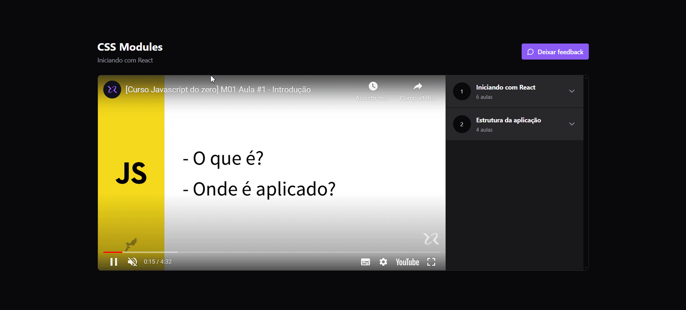

# ReactJS_ReduxAndZustand ⚛️

## About the Project

Project aiming to study exploring the tools [@redux](https://redux-toolkit.js.org/) and [@zustand](https://zustand-demo.pmnd.rs/)

_The project was initially created using @redux and migrated to @zustand_

## Technologies Used 🚀

This project is being developed using the following technologies:

- **ReactJS**
- **TailwindCSS**
- **ShadcnUI**
- **Vitest**
- **Typescript**
- **JSON-Server**
- **Zustand**
- **Redux(No longer in the project)**

## Getting Started

### Prerequisites

- NodeJS
- Yarn or NPM

### Installation

1. Clone the repository: 

```
git clone https://github.com/joaopelisson/ReactJS_ReduxAndZustand
```


2. Install the necessary packages:
```
npm i
or
yarn install
```

3. Run the project:
````
npm run dev
//and
npm run server 
````

---

🚀 Preview:



